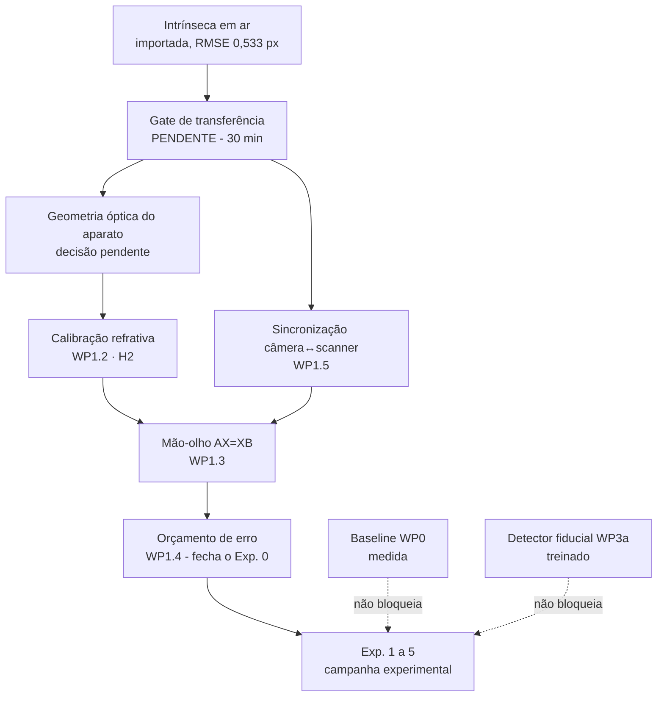

# Estado do projeto e próximos passos

**Data:** 2026-08-07 · **Escopo:** o que está medido, o que está bloqueado e em que ordem destravar.

---

## 1. Estado executivo

O projeto tem duas frentes maduras e uma cadeia de calibração que acabou de mudar de estratégia.

O detector fiducial profundo (WP3a) está treinado e avaliado. A baseline clássica (WP0) está medida. A calibração intrínseca deixou de ser medida aqui e passou a ser **importada** do projeto `vrchat`, onde a mesma câmera física foi calibrada com Caliscope em 2026-08-05.

O bloqueio central não mudou e não é de software: **não existe pose métrica validada** porque faltam três elos da cadeia de referenciais — calibração refrativa, calibração mão-olho e sincronização câmera↔scanner. Nenhuma afirmação em milímetros é defensável antes disso.



---

## 2. O que mudou em 2026-08-07

### A calibração própria foi aposentada

O pipeline anterior (`app.py` tkinter + `capturar.py` + `calibrar.py`) estava metodologicamente correto e produziu um resultado **reprovado pelos próprios critérios pré-registrados**:

| Critério | Exigido | Medido em 2026-07-29 | |
| :--- | ---: | ---: | :--- |
| vistas | ≥ 25 | 9 | reprova |
| cobertura | completa | 9/25 vistas; 0/4 escala média; 0/4 grande | reprova |
| RMS global | ≤ 0,50 px | 0,6124 px | reprova |
| P90 do erro de canto | ≤ 1,00 px | 0,9625 px | passa |
| erro mediano em holdout | ≤ 0,60 px | 0,5613 px | passa |
| largura relativa do IC 95% de `fx` | ≤ 2% | **61,5%** | reprova |

O último número é o que decide. Um IC 95% de `fx` indo de 1843 a 3625 não distingue uma câmera de 67° de campo de uma de 40°. Não é calibração ruim — é calibração que não mediu nada.

### A câmera foi identificada por assinatura óptica

A sessão de 2026-07-29 gravou apenas `{"indice": 0, "backend": "dshow"}`, sem nome de dispositivo. A identificação usou os coeficientes de distorção, que são adimensionais e independem de resolução:

| | `fx/largura` | FOV horizontal | k1, k2, k3 |
| :--- | ---: | ---: | :--- |
| pose, 2026-07-29, 3840×2160 | 0,7550 | 67,0° | +0,114, −0,410, +0,337 |
| **vrchat S600**, 1920×1080 | **0,7790** | **65,4°** | **+0,104, −0,450, +0,438** |
| vrchat C270, 1280×960 | 1,0856 | 49,5° | +0,007, **+0,374**, −0,865 |

A C270 tem `k2` de sinal oposto e 30% de diferença em `fx/largura` — outra lente. A S600 casa em sinal e magnitude nos cinco coeficientes; a diferença de 3,1% cabe folgadamente no IC 95% de ±61% da medição do pose. Somando o índice DirectShow 0, que no gate do `vrchat` é a S600, a câmera é a **EMEET SmartCam S600**, `stable_id` `USB\VID_328F&PID_00AD&MI_00\7&22EA2E16&0&0000`.

### O que está selado agora

`calibracao/perfis_ativos/s600.json` — Caliscope 0.11.3, 30 quadros, RMSE 0,533 px, cobertura 0,92, para **1920×1080 e só**.

```
fx = 1495,7420    fy = 1494,7817
cx =  906,2055    cy =  427,8687
dist = [+0,10439, −0,45015, −0,00671, −0,00478, +0,43790]
```

Estado: `transferencia: "nao_validada"`. `carregar_perfil_ativo()` **recusa** entregar esses números até o gate medir. Os cinco artefatos de origem foram copiados byte a byte do `vrchat` e conferem em SHA-256; o tabuleiro ChArUco é o mesmo objeto físico nos dois projetos (`f82d8fbb…`).

### Dois alertas que viajam dentro do perfil

1. **O foco não estava travado.** O gate do `vrchat` observou foco em 200, 243, 254 e 281, com `autofocus=1`. Foco muda `fx` e `fy`.
2. **A S600 tem FOV ajustável de 40° a 73°.** É ajuste digital e nenhum dos dois projetos registra a posição dele.

Qualquer um dos dois invalida a transferência sem deixar rastro no arquivo. É por isso que ela precisa ser medida, não presumida.

---

## 3. Estado por frente

| Frente | Estado | Evidência |
| :--- | :--- | :--- |
| Baseline clássica (WP0) | **medida** — 98–100% de detecção em água limpa; 60% no vídeo de menor nitidez | `baseline_aruco_wp0.csv` |
| Detector fiducial profundo (WP3a) | **treinado e avaliado** — mediana de erro de canto 0,74–1,03 px; 0,0% acima de 5 px | `treino_fiducial/RESULTADOS_V3.md` |
| Intrínseca em ar (WP1.1) | **importada, não validada** | `calibracao/perfis_ativos/s600.json` |
| Calibração refrativa (WP1.2 / H₂) | não iniciada | — |
| Mão-olho (WP1.3) | não iniciada | — |
| Orçamento de erro (WP1.4) | não iniciado | — |
| Sincronização câmera↔scanner (WP1.5) | não iniciada | — |
| Leitor `.m2k` | XML parseado; layout do `acq_data.bin` não decodificado | `analise_implementavel_agora.md` §1 |
| CAD da braçadeira | não obtido — bloqueia PVNet e dados sintéticos | — |
| Ground truth eletromecânico | não iniciado — **bloqueia toda afirmação de acurácia** | — |

### Os 13 vídeos de 27/05 são exploratórios

Confirmado por metadados: celular Android (`com.android.version: 16`), HEVC, taxa variável ~59,94 fps, `rotate: 180`. Câmera diferente da S600.

Eles continuam valendo para caracterizar o problema, medir a baseline clássica e gerar pseudo-rótulos do detector — nada disso depende de escala métrica. **Não** servem para pose em milímetros, erro em mm nem para testar H₂: os intrínsecos do celular naquela sessão são irrecuperáveis (autofoco livre e, provavelmente, estabilização eletrônica alterando o recorte quadro a quadro).

---

## 4. Um conflito de critério que precisa de decisão

`plano_implementacao.md`, WP1.1, exige **erro de reprojeção < 0,3 px**. A calibração importada mede **0,533 px**.

O número não pode ser ignorado nem relaxado em silêncio — a regra do projeto é que critério que falha se corrige recapturando, não mudando o número. As opções honestas:

| Opção | O que implica |
| :--- | :--- |
| **Rever o alvo com justificativa escrita** | 0,3 px RMS é exigente para webcam de consumo com lente plástica e autofoco. Registrar a revisão em ADR, com o valor novo e a razão, antes de medir qualquer coisa contra ele. |
| **Buscar calibração melhor com a mesma câmera** | Nova sessão Caliscope com foco travado, mais quadros e cobertura de escala completa. Pode não chegar a 0,3 px — o limite pode ser o hardware. |
| **Trocar de câmera** | Câmera de visão de máquina com lente com trava mecânica de foco e íris. Resolve o problema na raiz, mas muda o aparato e o orçamento. |

Vale notar que 0,533 px passa nos critérios do caminho externo Caliscope (0,80 px) e ficaria **reprovado** no limite do calibrador interno (0,50 px), por pouco. A escolha aqui condiciona o orçamento de erro da referência (WP1.4) e, portanto, a interpretação de todos os experimentos.

---

## 5. Próximos passos

### Passo 1 — Fechar o gate de transferência

**Bloqueia:** tudo que é métrico. **Esforço:** ~30 min. **Sem dependência.**

1. Montar a S600 em 1920×1080 MJPEG, foco manual travado, autofoco desligado. Ler `CAP_PROP_FOCUS` de volta e **registrar** se o driver obedeceu — se não obedecer, isso é um achado, não um detalhe.
2. Não mexer no ajuste de FOV da câmera, nem durante nem depois.
3. Capturar ~12 vistas do tabuleiro ChArUco em PNG, cobrindo a grade 3×3, metade frontais e metade inclinadas, distâncias de ~40 cm a ~1 m. Salvar em `calibracao/capturas_validacao/`.
4. Medir com trena a distância do plano do tabuleiro à lente em **uma** vista e anotar o nome do arquivo.

```bash
cd calibracao
python teste_caliscope.py                    # verifica o pipeline antes de medir

python validar_transferencia.py --perfil perfis_ativos/s600.json \
    --capturas capturas_validacao --output rig/transferencia.json --registrar

python validar.py --calibracao perfis_ativos/s600.json \
    --imagens capturas_validacao \
    --distancia-real-mm 600 --imagem-distancia vista_03.png
```

**Como ler o resultado:**

| `escala_fx_refit` | Resíduos | Leitura |
| :--- | :--- | :--- |
| em [0,98; 1,02] | dentro dos limites | Aprovado. Pode usar. |
| **fora** | quaisquer | Foco ou FOV mudaram. Recalibrar no Caliscope. **Não** corrigir `K` por esse fator. |
| dentro | acima | O erro não está em `fx/fy`. Investigar nitidez, iluminação, planaridade do impresso. |

O segundo comando não é redundante: mede consistência interna versus consistência com o mundo. O `solvePnP` esconde erro de escala na profundidade, então a trena é a única prova independente disso.

### Passo 2 — Decidir o critério de reprojeção

**Bloqueia:** o orçamento de erro. **Esforço:** uma conversa com o orientador + um ADR.

Ver §4. A decisão precisa estar escrita antes de qualquer aquisição com GT, porque ela define o piso de erro contra o qual toda diferença experimental será julgada. Diferença menor que o erro da referência não é evidência de nada.

### Passo 3 — Definir a geometria óptica do aparato

**Bloqueia:** a calibração refrativa. **Esforço:** uma sessão de medição no tanque.

O delineamento §6.2 descreve a câmera em *housing* submersível com janela plana. Os vídeos de 27/05 foram feitos com a câmera **fora**, filmando pela parede de vidro. A S600 é webcam USB e não é submersível. São duas configurações diferentes:

| Configuração | Interfaces | Consequência |
| :--- | :--- | :--- |
| Câmera fora, pela parede do tanque | ar → vidro → água | Distância câmera–vidro grande e precisa ser medida e mantida fixa. Amplifica o efeito refrativo. |
| Câmera em *housing* com *flat port* | ar → janela → água | Distância pequena e fixa por construção. É o caso que a literatura de *flat port* modela diretamente. |

Escolher uma e **medir e registrar**: distância câmera–interface, espessura do vidro, índice de refração do vidro, normal da interface em relação ao eixo óptico. Sem esses números não há calibração refrativa, só ajuste de curva.

Se a câmera ficar fora, também é preciso fixá-la mecanicamente — qualquer deslocamento entre sessões muda a geometria e invalida a calibração refrativa, ainda que os intrínsecos continuem válidos.

### Passo 4 — Calibração refrativa (WP1.2, insumo direto de H₂)

**Depende de:** passos 1 e 3.

O plano manda avaliar a ferramenta de Seegräber et al. (2025) antes de implementar do zero, e registrar a decisão em ADR (`survey/Calibration_Tool_Refractive_Underwater.pdf` já está no acervo). Implementar o controle pinhole+distorção em paralelo — a comparação entre os dois **é** o Experimento 3.

Critério de aceite: erro de reprojeção sob a água quantificado, com repetibilidade entre sessões.

### Passo 5 — Sincronização câmera↔scanner (WP1.5)

**Depende de:** passo 1. **Paralelizável com 3 e 4.**

Hoje não existe evento comum entre vídeo e `.m2k` — só alinhamento grosseiro por duração (~16 s), que não serve para associar pose a quadro de ultrassom. O plano já prevê LED visível no quadro disparado pelo trigger de aquisição. Implementar e **medir a latência residual**, não assumir que é zero.

### Passo 6 — Mão-olho (WP1.3)

**Depende de:** passos 4 e 5.

`AX = XB` entre scanner, câmera e peça. Repetir em N sessões e medir o **erro de fechamento de cadeia** — a repetibilidade é o número que importa, não uma medição isolada.

### Passo 7 — Orçamento de erro (WP1.4) — fecha o Exp. 0

**Depende de:** todos os anteriores.

Documento com a incerteza de cada elo: encoder, mão-olho, refração residual, intrínseca. É o critério de aceite do WP1 e a régua de leitura de todos os experimentos seguintes.

### Em paralelo, sem bloqueio

| Tarefa | Por que agora |
| :--- | :--- |
| Formalizar o WP0 no repositório: ingestão, catálogo, testes de geometria "ouro" | A baseline existe como script solto; precisa virar código versionado com teste antes da campanha. |
| Reprocessar a baseline em **todos** os quadros | A medição atual usou 1 quadro a cada 15. |
| Obter o CAD da braçadeira | Bloqueia PVNet (WP3b) e dados sintéticos (WP2b/H₃). É o item de maior lead time e não depende de ninguém aqui. |
| Confirmar o leitor `.m2k` com o laboratório | O lab provavelmente já tem ferramenta M2M/CIVA; decodificar `acq_data.bin` do zero seria retrabalho. |

### Correções de aparato antes da próxima sessão de tanque

Levantadas dos próprios dados de 27/05 (`analise_implementavel_agora.md` §5) e ainda abertas:

1. **Um único marcador grande visível por quadro** → pose de 4 pontos coplanares, fraca em orientação e ambígua em profundidade. Fixar tabuleiro ChArUco à braçadeira ou ≥ 3 marcadores maiores em faces distintas.
2. **Dicionários misturados** (DICT_7X7 ID 0 e DICT_5X5 ID 3) sem geometria relativa documentada. Medir e registrar a transformação marcador→transdutor — sem ela não há registro espacial.
3. **Nitidez caiu ~4× ao longo da sessão** (2715 → 684). Identificar a causa (turbidez crescente? iluminação? foco?) e registrar NTU por sessão.
4. **Marcadores pequenos não são detectados** pelo detector clássico — é o primeiro caso de uso real do detector profundo e, ao mesmo tempo, um problema de dimensionamento do aparato.
5. **Reflexos da parede de vidro e oclusão pela mão do operador** aparecem nos quadros. Úteis como oclusão natural, mas precisam ser catalogados em vez de contaminarem silenciosamente as métricas.

---

## 6. Invariantes

- **Nada métrico sai dos vídeos de 27/05.** São exploratórios: baseline, caracterização e pseudo-rótulos.
- **Os intrínsecos valem para 1920×1080 e só.** A S600 também faz 3840×2160@30, mas esse modo nunca foi calibrado. Escalar `K` por 2 assume recorte de sensor idêntico — ninguém mediu isso.
- **`escala_fx_refit` é diagnóstico, nunca correção.** Fora da janela significa recalibrar, não multiplicar `K`.
- **Não recalibrar sem evidência física.** Se o foco não mudou e o gate aprova, a calibração de 2026-08-05 continua valendo.
- **Diferença menor que o erro da referência não é evidência.** Vale para todos os experimentos, e é por isso que o orçamento de erro precede a campanha.
- **A calibração importada declara a própria fronteira:** não contém evidência de validação interna, não alega a metodologia do calibrador próprio, e SHA-256 detecta alteração local mas não autentica operador nem origem.

---

## 7. Referência rápida de arquivos

| Caminho | Papel |
| :--- | :--- |
| `calibracao/README.md` | Método da importação e do gate, com os números que justificam cada limite. |
| `calibracao/GUIA_SESSAO.md` | Passo a passo da sessão de validação (~15 min). |
| `calibracao/perfis_ativos/s600.json` | Perfil selado ativo. Estado da transferência vive aqui. |
| `calibracao/rig/caliscope-import.json` | Documento importado, com manifesto e hashes. |
| `calibracao/origem_caliscope/` | Artefatos do Caliscope, byte a byte do `vrchat`. |
| `delineamento_pesquisa_mestrado.md` | Hipóteses, protocolo experimental, aparato. |
| `plano_implementacao.md` | WPs, critérios de aceite, cronograma. |
| `analise_implementavel_agora.md` | Caracterização medida dos insumos de 27/05. |
| `treino_fiducial/RESULTADOS_V3.md` | Resultado do detector profundo. |
