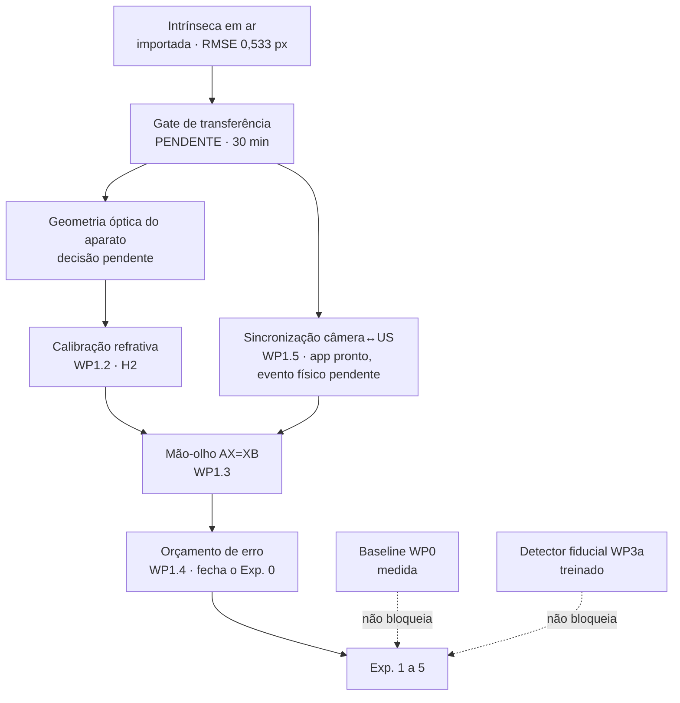

# Estado executivo

Pesquisa de mestrado em estimação visual de pose 6DoF de transdutor ultrassônico
e registro espacial 3D de imagens de ultrassom para inspeção subaquática por END.
O delineamento completo está em [`delineamento_pesquisa_mestrado.md`](delineamento_pesquisa_mestrado.md)
e o plano de execução em [`plano_implementacao.md`](plano_implementacao.md).

Duas frentes estão maduras e medidas: a baseline clássica (WP0) e o detector
fiducial profundo (WP3a). A calibração intrínseca mudou de estratégia em
2026-08-07 — deixou de ser medida aqui e passou a ser importada e selada do
projeto `vrchat`.

O bloqueio central não é de software: faltam três elos da cadeia de referenciais
— calibração refrativa, mão-olho e sincronização câmera↔ultrassom. **Nenhuma
afirmação em milímetros é defensável antes de fechar o WP1.**



# Estado por frente

| Frente | Estado | Evidência |
| :--- | :--- | :--- |
| Baseline clássica (WP0) | **medida** — 98–100% de detecção em água limpa; 60% no vídeo de menor nitidez | [`baseline_aruco_wp0.csv`](baseline_aruco_wp0.csv) |
| Detector fiducial profundo (WP3a) | **treinado e avaliado** — 0,0% de cantos acima de 5 px em todos os níveis de degradação; P90 < 2 px | [`treino_fiducial/RESULTADOS_V3.md`](treino_fiducial/RESULTADOS_V3.md) |
| Intrínseca em ar (WP1.1) | **importada, não validada nesta bancada** | [`calibracao/perfis_ativos/s600.json`](calibracao/perfis_ativos/s600.json) |
| Aquisição sincronizada | **app pronto**, sincronismo em nível grosseiro até existir evento físico | [`aquisicao/README.md`](aquisicao/README.md) |
| Calibração refrativa (WP1.2 / H₂) | não iniciada | — |
| Mão-olho (WP1.3) | não iniciada | — |
| Orçamento de erro (WP1.4) | não iniciado | — |
| Leitor `.m2k` | XML parseado; layout do `acq_data.bin` não decodificado | [`analise_implementavel_agora.md`](analise_implementavel_agora.md) |
| CAD da braçadeira | não obtido — bloqueia PVNet e dados sintéticos | — |
| Ground truth eletromecânico | não iniciado — **bloqueia toda afirmação de acurácia** | — |

# O que mudou em 2026-08-07

## A calibração própria foi aposentada

O pipeline anterior (`app.py` tkinter + `capturar.py` + `calibrar.py`) estava
metodologicamente correto e produziu um resultado **reprovado pelos próprios
critérios pré-registrados**:

| Critério | Exigido | Medido em 2026-07-29 | |
| :--- | ---: | ---: | :--- |
| vistas | ≥ 25 | 9 | reprova |
| cobertura | completa | 9/25 vistas; 0/4 escala média; 0/4 grande | reprova |
| RMS global | ≤ 0,50 px | 0,6124 px | reprova |
| P90 do erro de canto | ≤ 1,00 px | 0,9625 px | passa |
| erro mediano em holdout | ≤ 0,60 px | 0,5613 px | passa |
| largura relativa do IC 95% de `fx` | ≤ 2% | **61,5%** | reprova |

O último número decide: um IC 95% de `fx` indo de 1843 a 3625 não distingue uma
câmera de 67° de campo de uma de 40°. Não é calibração ruim — é calibração que
não mediu nada.

## A câmera foi identificada por assinatura óptica

A sessão de 2026-07-29 gravou apenas `{"indice": 0, "backend": "dshow"}`, sem
nome de dispositivo. A identificação usou os coeficientes de distorção, que são
adimensionais e independem de resolução:

| | `fx/largura` | FOV horizontal | k1, k2, k3 |
| :--- | ---: | ---: | :--- |
| pose, 2026-07-29, 3840×2160 | 0,7550 | 67,0° | +0,114, −0,410, +0,337 |
| **vrchat S600**, 1920×1080 | **0,7790** | **65,4°** | **+0,104, −0,450, +0,438** |
| vrchat C270, 1280×960 | 1,0856 | 49,5° | +0,007, **+0,374**, −0,865 |

A C270 tem `k2` de sinal oposto e 30% de diferença — outra lente. A S600 casa em
sinal e magnitude nos cinco coeficientes, e a diferença de 3,1% cabe folgadamente
no IC 95% de ±61%. Somando o índice DirectShow 0, a câmera é a **EMEET SmartCam
S600**, `stable_id` `USB\VID_328F&PID_00AD&MI_00\7&22EA2E16&0&0000`.

## Foi construído o app de aquisição sincronizada

`aquisicao/` grava vídeo da S600 com carimbo por quadro e marca o instante do
clique que aciona o software de ultrassom. A câmera captura desde o PREPARAR e o
clique apenas carimba um instante no fluxo — iniciar a captura no clique somaria
a latência de abertura da webcam ao sincronismo, sem medi-la.

# Artefatos canônicos

| Arquivo | SHA-256 (16 primeiros) | Observação |
| :--- | :--- | :--- |
| `calibracao/perfis_ativos/s600.json` | `9888E24CFA53385E` | Perfil selado ativo. |
| `calibracao/rig/caliscope-import.json` | `1FC34060416D96E9` | Documento importado. |
| `calibracao/caliscope-import.json` | `66B9014299CD35B6` | Config da importação. |
| `calibracao/saida/tabuleiro.json` | `F82D8FBB06BBD28D` | Contrato do tabuleiro — **idêntico ao do vrchat**. |

Identificadores do perfil ativo:

```
activation_id    2aea9c092b0b4d386413840d
import_id        73eb2587900142dbf3547926
source_identity  0cd13ba484d1f15edac21c31
transferencia    nao_validada
```

Intrínsecos importados, válidos **somente** para 1920×1080:

```
fx = 1495,7420    fy = 1494,7817
cx =  906,2055    cy =  427,8687
dist = [+0,10439, −0,45015, −0,00671, −0,00478, +0,43790]
origem: Caliscope 0.11.3 · 30 quadros · RMSE 0,533 px · cobertura 0,92 · 2026-08-05
```

Os cinco artefatos de origem em `calibracao/origem_caliscope/` foram copiados
byte a byte do projeto `vrchat` e conferem em SHA-256 com o manifesto selado lá.

## Dois alertas que viajam dentro do perfil

1. **O foco não estava travado.** O gate do `vrchat` observou foco em 200, 243,
   254 e 281, com `autofocus=1`.
2. **A S600 tem FOV ajustável de 40° a 73°.** É ajuste digital e nenhum dos dois
   projetos registra a posição dele.

Qualquer um dos dois invalida a transferência sem deixar rastro no arquivo. É por
isso que ela precisa ser medida, não presumida.

# Decisões em aberto que travam o WP1

## 1. Conflito de critério de reprojeção

`plano_implementacao.md` (WP1.1) exige **< 0,3 px**. A calibração importada mede
**0,533 px** — passa no limite externo do Caliscope (0,80) e reprovaria no
interno (0,50), por pouco.

O número não pode ser relaxado em silêncio. Opções honestas:

| Opção | Implicação |
| :--- | :--- |
| Rever o alvo com ADR escrito | 0,3 px RMS é exigente para webcam de consumo com lente plástica e autofoco. Registrar o valor novo e a razão **antes** de medir contra ele. |
| Buscar calibração melhor | Nova sessão Caliscope com foco travado, mais quadros, cobertura de escala completa. Pode não chegar a 0,3 px — o limite pode ser o hardware. |
| Trocar de câmera | Câmera de visão de máquina com trava mecânica de foco. Resolve na raiz, muda aparato e orçamento. |

A escolha condiciona o orçamento de erro (WP1.4) e a interpretação de **todos** os
experimentos.

## 2. Geometria óptica do aparato

O delineamento §6.2 descreve a câmera em *housing* submersível com janela plana.
Os vídeos de 27/05 foram feitos com a câmera **fora**, pela parede de vidro. A
S600 é webcam USB e não é submersível.

| Configuração | Interfaces | Consequência |
| :--- | :--- | :--- |
| Câmera fora, pela parede | ar → vidro → água | Distância câmera–vidro grande, precisa ser medida e fixada. Amplifica o efeito refrativo. |
| *Housing* com *flat port* | ar → janela → água | Distância pequena e fixa. É o caso que a literatura de *flat port* modela direto. |

Escolher uma e **medir**: distância câmera–interface, espessura do vidro, índice
de refração, normal da interface. Sem esses números não há calibração refrativa,
só ajuste de curva. Se a câmera ficar fora, fixá-la mecanicamente — deslocamento
entre sessões invalida a refrativa.

## 3. Modelo do equipamento de ultrassom

Os arquivos provam o fabricante (DTD `FR.M2M` / `FR.MULTI2000`), o software
(**Multi2000 9.2.0**, build 2021-04-26), `typeAppareil="19"`, sonda de 64
elementos, PRF 3633 Hz, amostragem 125 MHz, `modeAcquisitionSurTrigger="1"` e
codificador ativo `Temps` a 125 MHz. **Não provam o modelo da caixa.**

Saber o modelo decide se existe saída de sincronismo utilizável — o que sobe o
sincronismo de grosseiro (±100–300 ms) para fino (~1,7 ms).

# Sincronismo: o que o app garante e o que não garante

| Nível | Quando | Incerteza | Serve para |
| :--- | :--- | ---: | :--- |
| `grosseira` | **estado atual** — só o clique | não medida, ~50–300 ms | alinhar trechos de trajetória com trechos de aquisição |
| `um_quadro` | luz de sincronismo no quadro | 16,7 ms | associar pose a janelas curtas |
| `fina` | luz com quadro de transição parcial | ~1,7 ms | associar pose a A-scan individual |

A 30 mm/s de varredura manual, o erro de tempo vira erro de posição:

| Δt | erro de posição |
| ---: | ---: |
| 300 ms | 9 mm |
| 100 ms | 3 mm |
| 16,7 ms | 0,5 mm |
| 1,7 ms | 0,05 mm |

É esta tabela que decide se o clique basta. Para subir de nível é preciso um
evento comum **físico** — uma luz no campo de visão acionada pelo mesmo sinal
que dispara a aquisição.

# Sequência de retomada

## Passo 1 — Fechar o gate de transferência (~30 min, sem dependência)

Bloqueia tudo que é métrico.

```bash
cd calibracao
python teste_caliscope.py          # verifica o pipeline antes de medir

# capturar ~12 vistas ChArUco em 1920x1080, foco manual travado,
# grade 3x3 coberta, metade frontais e metade inclinadas, 40 cm a 1 m
# em calibracao/capturas_validacao/

python validar_transferencia.py --perfil perfis_ativos/s600.json \
    --capturas capturas_validacao --output rig/transferencia.json --registrar

python validar.py --calibracao perfis_ativos/s600.json \
    --imagens capturas_validacao \
    --distancia-real-mm 600 --imagem-distancia vista_03.png
```

Leitura do resultado:

| `escala_fx_refit` | Resíduos | Leitura |
| :--- | :--- | :--- |
| em [0,98; 1,02] | dentro dos limites | Aprovado. |
| **fora** | quaisquer | Foco ou FOV mudaram. Recalibrar no Caliscope. **Não** corrigir `K` por esse fator. |
| dentro | acima | O erro não está em `fx/fy`. Investigar nitidez, iluminação, planaridade. |

O segundo comando não é redundante: mede consistência com o **mundo**, não
consistência interna. O `solvePnP` esconde erro de escala na profundidade.

## Passo 2 — Decidir o critério de reprojeção (ADR)

Ver "Decisões em aberto" §1. Precisa estar escrito antes de qualquer aquisição
com GT: define o piso contra o qual toda diferença experimental será julgada.

## Passo 3 — Definir e medir a geometria óptica do aparato

Ver "Decisões em aberto" §2.

## Passo 4 — Calibração refrativa (WP1.2, insumo direto de H₂)

Depende de 1 e 3. O plano manda avaliar a ferramenta de Seegräber et al. (2025)
antes de implementar do zero, com decisão registrada em ADR
(`survey/Calibration_Tool_Refractive_Underwater.pdf`). Implementar o controle
pinhole+distorção em paralelo — a comparação **é** o Experimento 3.

## Passo 5 — Sincronização (WP1.5), paralelizável

O app está pronto. Falta o evento físico. Se a caixa de aquisição tiver saída de
sincronismo, uma luz acionada por ela dá o evento comum. Dois detalhes:

- se a saída for pulso curto por disparo, LED ligado direto fica invisível
  (*duty cycle* ~0,04%) — precisa de esticador de pulso (monoestável retrigável
  ou RC com transistor);
- a luz precisa ocupar região estável do quadro, sem reflexo do tanque em cima.

Depois: `python gravar.py --roi X Y W H`.

Medir também a latência do pipeline: `python medir_latencia.py --repeticoes 20`.

## Passo 6 — Mão-olho (WP1.3)

`AX = XB` entre scanner, câmera e peça. Repetir em N sessões e medir o **erro de
fechamento de cadeia** — a repetibilidade é o número que importa.

## Passo 7 — Orçamento de erro (WP1.4) — fecha o Exp. 0

Incerteza de cada elo: encoder, mão-olho, refração residual, intrínseca. É o
critério de aceite do WP1 e a régua de leitura de todos os experimentos.

## Em paralelo, sem bloqueio

| Tarefa | Por que agora |
| :--- | :--- |
| Formalizar o WP0 no repositório: ingestão, catálogo, testes de geometria "ouro" | A baseline existe como script solto; precisa virar código versionado com teste. |
| Reprocessar a baseline em **todos** os quadros | A medição atual usou 1 quadro a cada 15. |
| **Obter o CAD da braçadeira** | Maior *lead time*, bloqueia PVNet (WP3b) e dados sintéticos (WP2b/H₃), não depende de ninguém aqui. |
| Confirmar o leitor `.m2k` com o laboratório | O lab provavelmente já tem ferramenta M2M/CIVA; decodificar `acq_data.bin` do zero seria retrabalho. |

# Correções de aparato antes da próxima sessão de tanque

Levantadas dos próprios dados de 27/05 e ainda abertas:

1. **Um único marcador grande visível por quadro** → pose de 4 pontos
   coplanares, fraca em orientação e ambígua em profundidade. Fixar tabuleiro
   ChArUco à braçadeira ou ≥ 3 marcadores maiores em faces distintas.
2. **Dicionários misturados** (DICT_7X7 ID 0 e DICT_5X5 ID 3) sem geometria
   relativa documentada. Medir e registrar a transformação marcador→transdutor —
   sem ela não há registro espacial.
3. **Nitidez caiu ~4× ao longo da sessão** (2715 → 684). Identificar a causa e
   registrar NTU por sessão.
4. **Marcadores pequenos não são detectados** pelo detector clássico — primeiro
   caso de uso real do detector profundo e, ao mesmo tempo, problema de
   dimensionamento do aparato.
5. **Reflexos da parede e oclusão pela mão do operador** precisam ser catalogados
   em vez de contaminarem silenciosamente as métricas.

# Invariantes

- **Os 13 vídeos de 27/05 são exploratórios.** Celular Android
  (`com.android.version: 16`), HEVC, taxa variável, `rotate: 180`. Servem para
  baseline, caracterização e pseudo-rótulos. **Nada métrico sai deles** — os
  intrínsecos do celular naquela sessão são irrecuperáveis. Todos os experimentos
  futuros usam a S600.
- **Os intrínsecos valem para 1920×1080 e só.** A S600 também faz 3840×2160@30,
  mas esse modo nunca foi calibrado. Escalar `K` por 2 assume recorte de sensor
  idêntico — ninguém mediu isso.
- **`escala_fx_refit` é diagnóstico, nunca correção.** Fora da janela significa
  recalibrar, não multiplicar `K`.
- **O vídeo é gravado cru.** A calibração viaja como metadado, não aplicada.
  Corrigir distorção na gravação destruiria informação irreversivelmente e
  prenderia a sessão a um modelo — e a refrativa ainda é experimento em aberto.
- **Não recalibrar sem evidência física.** Se o foco não mudou e o gate aprova, a
  calibração de 2026-08-05 continua valendo.
- **Diferença menor que o erro da referência não é evidência.** Por isso o
  orçamento de erro precede a campanha.
- **A calibração importada declara a própria fronteira:** não contém evidência de
  validação interna, não alega a metodologia do calibrador próprio, e SHA-256
  detecta alteração local mas **não autentica operador nem origem**.

# Um resultado de método que vale carregar adiante

Erro de reprojeção **não detecta** distância focal errada. O `solvePnP` absorve o
erro de escala na profundidade. Medido em `calibracao/teste_caliscope.py`, com
`fx` deliberadamente 5% errado:

| | medido | limite | |
| :--- | ---: | ---: | :--- |
| erro mediano | 0,171 px | 0,60 | passaria |
| erro P90 | 0,483 px | 1,20 | passaria |
| `escala_fx_refit` | 1,0496 | [0,98; 1,02] | **reprova** |

Um gate que só olhasse resíduo teria aprovado um foco 5% errado — e 5% de escala
vira 5% de erro de distância direto no resultado. Vale para qualquer validação de
pose neste projeto, não só para a calibração.

# Ambiente e verificação

```bash
pip install pynput pillow        # só o app de aquisição precisa

cd calibracao && python teste_caliscope.py    # selo, manifesto e gate
cd ../aquisicao && python teste_aquisicao.py  # sincronismo com fonte sintética
```

Ambos verdes em 2026-08-07. `caliscope_import.py` usa `tomllib` (Python ≥ 3.11)
com fallback para `tomli`.

Dependências: OpenCV, NumPy, Pillow, pynput. O detector fiducial tem ambiente
próprio em `treino_fiducial/.venv` (PyTorch).

**Não testado contra hardware real:** `aquisicao/gravar.py` nunca rodou com a
câmera conectada — só os módulos de lógica têm teste. Se a S600 não negociar
1920×1080 MJPEG, o app recusa gravar de propósito e a mensagem diz o que veio no
lugar.

# Mapa do repositório

| Caminho | Papel |
| :--- | :--- |
| `delineamento_pesquisa_mestrado.md` | Hipóteses H₁–H₃, protocolo experimental, aparato. |
| `plano_implementacao.md` | WPs, critérios de aceite, cronograma. |
| `analise_implementavel_agora.md` | Caracterização **medida** dos insumos de 27/05. |
| `baseline_aruco_wp0.csv` | Baseline clássica por vídeo. |
| `calibracao/README.md` | Método da importação e do gate, com os números que justificam cada limite. |
| `calibracao/GUIA_SESSAO.md` | Passo a passo da sessão de validação (~15 min). |
| `aquisicao/README.md` | Fluxo de gravação, níveis de sincronismo, latência. |
| `treino_fiducial/RESULTADOS_V3.md` | Resultado do detector profundo. |
| `treino_fiducial/AUDITORIA*.md` | Auditorias dos ciclos v1/v2, incluindo o resultado negativo do RefineNet. |
| `survey/survey_bibliografico_end_subaquatico.md` | Revisão bibliográfica. |
| `roteiro_apresentacao_completo.md` | Roteiro da apresentação de delineamento. |

Os PDFs de terceiros em `survey/` não são versionados (direito autoral e peso);
`data/` (~3,5 GB de `.m2k`) e `videos/` (~580 MB) também não. São insumo
experimental, não código.
