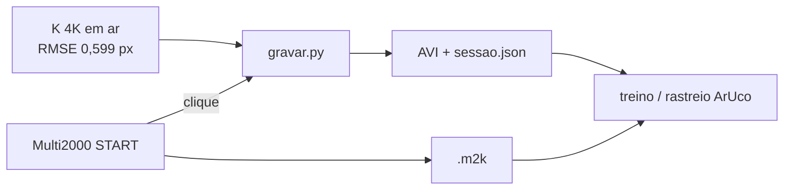

# Estado

Pesquisa de mestrado: pose 6DoF visual do transdutor ultrassônico e registro
espacial 3D de US para inspeção subaquática (END). Delineamento em
[`delineamento_pesquisa_mestrado.md`](delineamento_pesquisa_mestrado.md).

**Agora:** campanha de vídeo 4K + Multi2000, sync por **clique**, para treinar
e rastrear o marcador. Refrativa, mão-olho e afirmações em mm ficam para depois.



| Frente | Estado |
| :--- | :--- |
| Intrínseca em ar | **fechada** — S600 3840×2160@30 MJPEG, Caliscope 0.11.3, RMSE 0,599 px, 30 quadros |
| Aparato | câmera no tripé **fora** do tanque; marcador e sonda **na água**; sem *housing* |
| Aquisição | `aquisicao/gravar.py` — sync `grosseira` (clique). Não é A-scan |
| Detector fiducial (WP3a) | treinado (P90 < 2 px; 0% de cantos > 5 px) |
| Baseline ArUco (WP0) | medida em água limpa |
| Refrativa / mão-olho / GT eletromecânico | **adiados** |

# Como gravar

Mesmo PC do Multi2000. Preview na janela. Fila de 600 quadros: atraso de disco
**descarta** quadro (`descartes` no JSON), não estoura RAM.

```bash
.venv/Scripts/python.exe aquisicao/gravar.py
```

1. **PREPARAR** — tem de abrir 3840×2160. Se recusar, o modo não travou.
2. **ARMAR** — começa o pré-roll no `.avi`.
3. Clique **START** no Multi2000 **fora** da janela do app.
4. **PARAR** e espere **SALVO**.
5. Copie o `.m2k` para o mesmo id de sessão.

Smoke primeiro (~20 s). No JSON: `fps_medido` e `descartes`.

Take `aquisicao/sessoes/20260901_165544_983`: modo 4K abriu, 0 descartes, sync
`grosseira`, **fps_medido 20,79** (não 30), autofoco pedido 0 / lido 2.

# Calibração (só o que vale)

Artefatos canônicos:

| Arquivo | Papel |
| :--- | :--- |
| `calibracao/perfis_ativos/s600.json` | `K` ativo, selado |
| `calibracao/origem_caliscope/` | TOML do Caliscope (3840×2160) |
| `calibracao/caliscope-import.json` | manifesto de importação |
| `calibracao/saida/tabuleiro.json` | contrato ChArUco 7×5, 34,0 mm/quadrado |
| `calibracao/modo_s600.json` | modo do experimento |

Não há `K` de 1080p neste repositório. Não escalar por 2. Não reabrir
Autocalibrate a menos que foco/FOV/`d_cam` mudem de verdade.

Recaptura intrínseca (raro): `calibracao/gravar_ffmpeg_s600.cmd` →
`aceitar_captura.py` → Caliscope Autocalibrate cam 0 →
`python caliscope_cli.py importar && ativar`. SkellyCam em 4K estoura RAM.

# O que o clique não é

O JSON declara `sincronismo.qualidade.nivel = grosseira`. Serve para casar o
vídeo com o `.m2k` da mesma varredura. Não autoriza “este quadro = este A-scan”.

# Fora do git

`data/` (`.m2k`), `videos/`, MP4 do Caliscope (~2 GB), AVI das sessões.
O JSON da sessão entra; o vídeo não.
