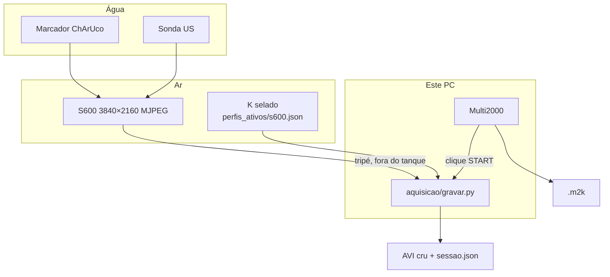

# pose

Estimação visual de pose 6DoF de transdutor ultrassônico e registro espacial 3D
de imagens de ultrassom para inspeção subaquática por END.

Pesquisa de mestrado. Delineamento:
[`delineamento_pesquisa_mestrado.md`](delineamento_pesquisa_mestrado.md).
**Retomando? Comece por [`HANDOFF.md`](HANDOFF.md).**

## Como funciona hoje



A câmera fica no **tripé, no ar**. Marcador e sonda ficam **na água**, vistos
através da parede do tanque. Não há *housing*. O vídeo vai para o disco **sem**
`undistort`: o `K` viaja no JSON, não aplicado no arquivo.

## Calibração intrínseca

Medida nesta bancada em 2026-09-01 com **Caliscope 0.11.3** (não com calibrador
próprio):

| | |
| :--- | :--- |
| Modo | 3840×2160 @ 30 MJPEG |
| RMSE | 0,599 px (30 quadros, cobertura 100%) |
| Perfil | [`calibracao/perfis_ativos/s600.json`](calibracao/perfis_ativos/s600.json) |
| Tabuleiro | ChArUco `DICT_4X4_50`, 7×5, 34,0 mm/quadrado |

O `K` vale **só** para esse modo. Recaptura: ver [`calibracao/README.md`](calibracao/README.md).

## Aquisição (campanha)

```bash
.venv/Scripts/python.exe aquisicao/gravar.py
```

PREPARAR (3840×2160) → ARMAR → START no Multi2000 fora da janela → PARAR → SALVO.

O sync é **grosseiro** (clique). Detalhes: [`aquisicao/README.md`](aquisicao/README.md).

## Estrutura

    aquisicao/         gravar.py — vídeo + clique + metadados
    calibracao/        K 4K (Caliscope), tabuleiro, importador
    treino_fiducial/   detector de cantos ChArUco (PyTorch)
    survey/            revisão bibliográfica
    data/              .m2k (não versionado)
    videos/            takes de tanque (não versionado)

## Verificação

```bash
.venv/Scripts/python.exe calibracao/teste_caliscope.py
.venv/Scripts/python.exe aquisicao/teste_aquisicao.py
```

## Dados fora do git

Aquisições `.m2k`, vídeos, MP4 do Caliscope, pesos `.pt` e venvs não entram no
histórico. O JSON da sessão (hash, carimbos, proveniência) sim.
