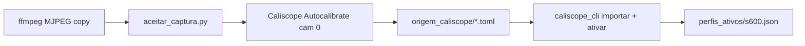

# Calibração intrínseca

O `K` da S600 foi **medido nesta bancada** em 2026-09-01 com Caliscope 0.11.3,
modo **3840×2160 @ 30 MJPEG**, RMSE **0,599 px**, 30 quadros, cobertura 100%.

Não há calibrador próprio neste projeto. Não há `K` de 1080p versionado.
Não se escala `K` por 2.

## Artefatos

| Caminho | Papel |
| :--- | :--- |
| `perfis_ativos/s600.json` | Perfil ativo, selado (`activation_id`) |
| `origem_caliscope/` | `camera_array.toml` + relatório + ChArUco |
| `caliscope-import.json` | Manifesto: hashes recalculados na importação |
| `rig/caliscope-import.json` | Documento selado (`import_id`) |
| `saida/tabuleiro.json` | Contrato: `DICT_4X4_50`, 7×5, **34,0 mm** |
| `modo_s600.json` | Resolução/fps/codec travados para o experimento |



## Recapturar (só se foco, FOV ou `d_cam` mudarem)

1. `calibracao/gravar_ffmpeg_s600.cmd` — preview + cópia MJPEG para o workspace.
2. `python aceitar_captura.py` — recusa qualquer coisa que não seja 3840×2160.
3. Caliscope 0.11.3 no workspace; aba Intrinsics → cam 0 → Autocalibrate.
   Gate externo: RMSE ≤ 0,80 px. Falhou → recaptura, não afrouxa o número.
4. Copiar os TOML para `origem_caliscope/` e:

```bash
python caliscope_cli.py importar --config caliscope-import.json --output rig/caliscope-import.json --overwrite
python caliscope_cli.py ativar rig/caliscope-import.json --destino perfis_ativos/s600.json --overwrite
```

SkellyCam em 4K estoura RAM (fila BGR ~25 MB/quadro). Não usar.

## O que o `K` não cobre

É intrínseca **em ar**. A geometria do experimento é tripé fora + parede do
tanque + água. Refração (H₂) é trabalho futuro. Gravamos o vídeo cru; o modelo
óptico aplica-se depois.

## Tabuleiro

O contrato em `saida/tabuleiro.json` é o impresso físico (34,0 mm/quadrado).
Marcas 7×7 / 5×5 do tanque são outro objeto. Não edite o JSON à mão: regenere
com `gerar_tabuleiro.py` se o paquímetro discordar.

## Verificação

```bash
python teste_caliscope.py
```

Confere selo, manifesto e o gate de transferência em imagens sintéticas:
aprova o `K` certo e **reprova** um `fx` 5% errado.
